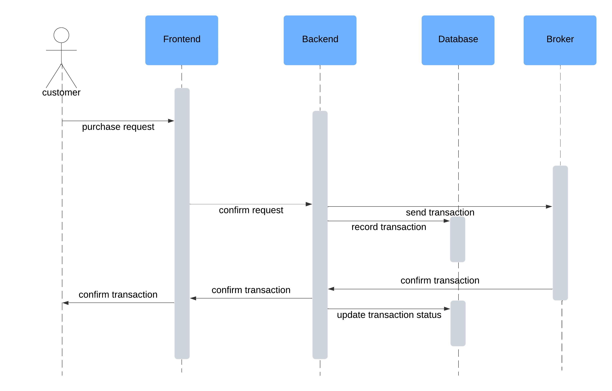

# 5520project
project-- coffee shop

# Frontend
### Prerequisites

Ensure you have the following installed on your machine:

- [Node.js](https://nodejs.org/) (version 14.x or higher recommended)
- [npm](https://www.npmjs.com/) (Node package manager, comes with Node.js)

### Installation

1. Clone the repository: 
	```sh 
	git clone https://github.com/FangyuanCao/5520project
2. Install Packages 
	```sh 
	npm install 
3. Run the app 
	```sh 
	npm start 

### References for frontend libraries
1. React
2. Material UI
3. React testing and Jest

# Backend
### Prerequisites
Ensure you have installed Python, we are using Python 3.11.

### Installation
Install library
1. Clone the repository.
2. Install packages under coffee-shop-backend folder
	```sh
	pip install -r requirements.txt
3. Run the backend
	```sh
	py app.py
 ### References for backend libraries
 1. Flask API (server)
 2. SQLAlchemy (DB implementation)
 3. pytest (Flask-Testing)
 4. bcrypt (secure hashing)


# Commit strategy and Branch handlement
### Branching
The main branch is the only one we commit to with valid changes. We previously create two branches mainly for local test and experiment. These two additional branches were used to learn the process with Github, however, we decide to mainly focus on main branch as rest for rest of the development process

### Commit strategy
We started developping the project in late September
The main strategy we used is the incremental and agile development that implement and integrate components with different iterations.

### Sequence diagram

